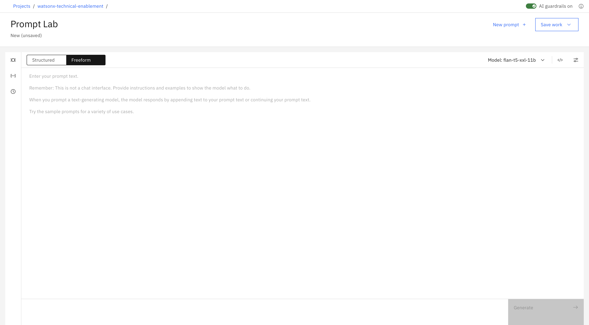
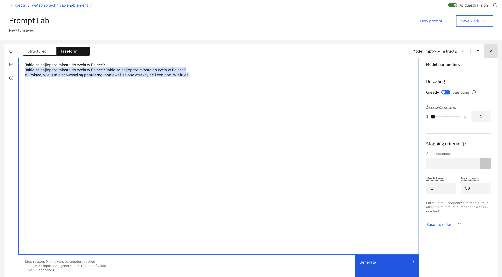
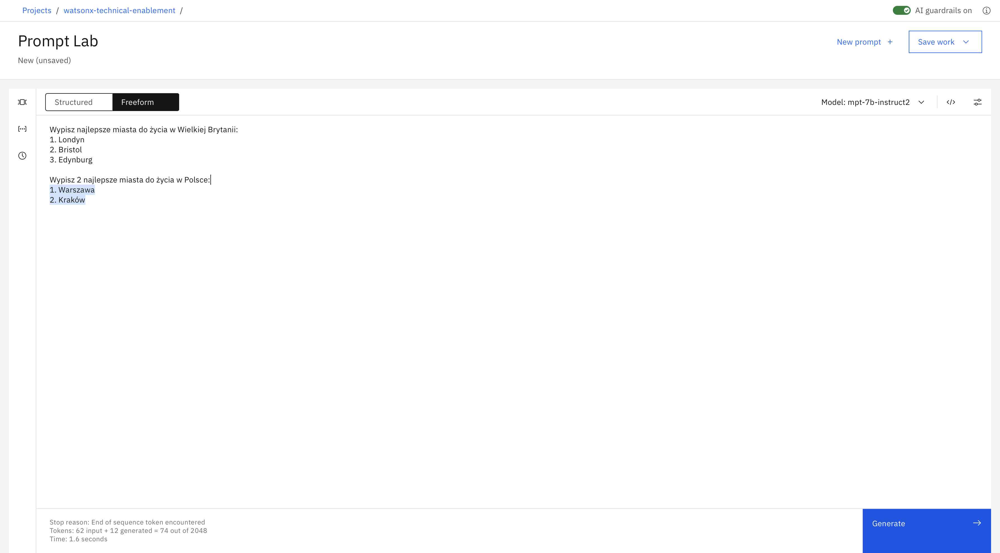
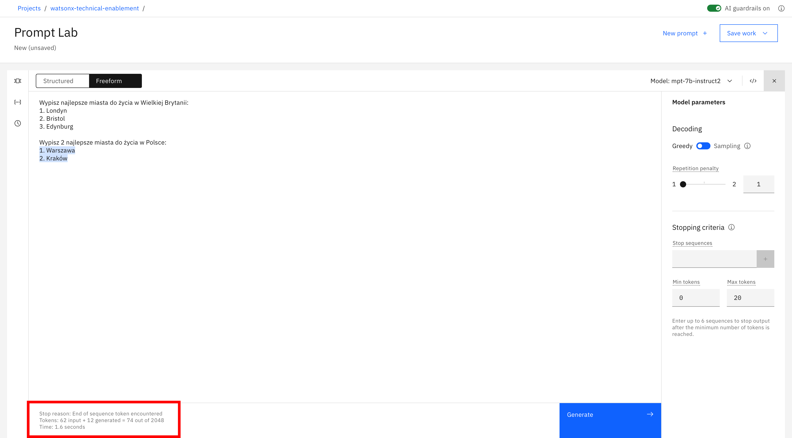
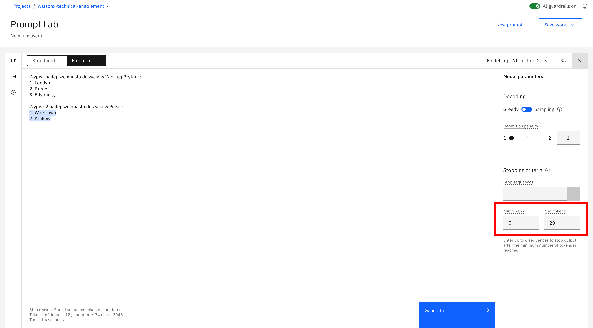
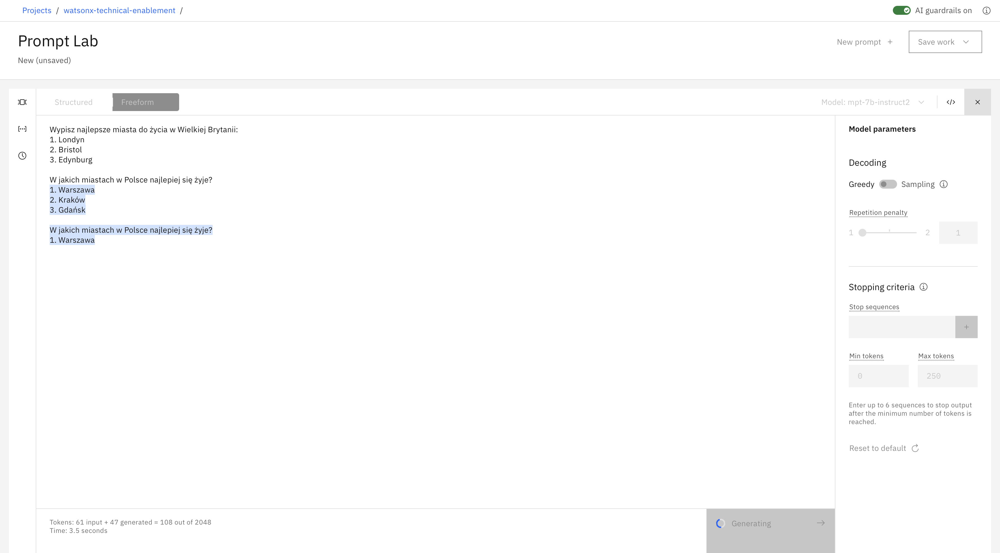
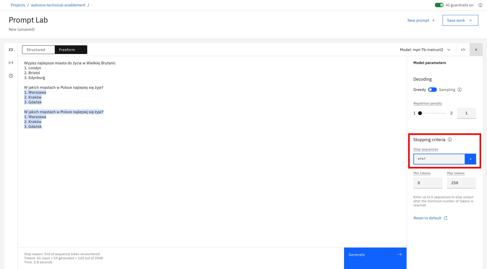
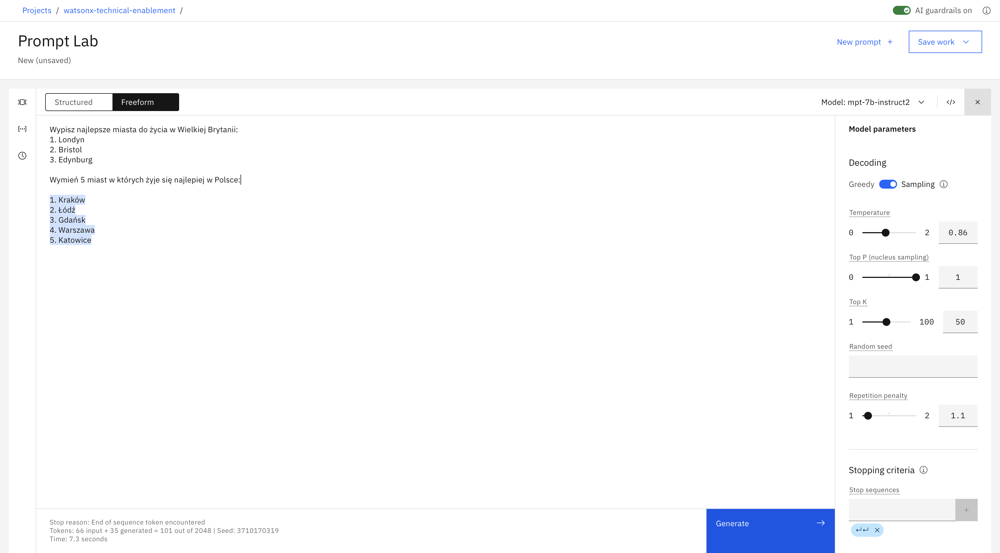
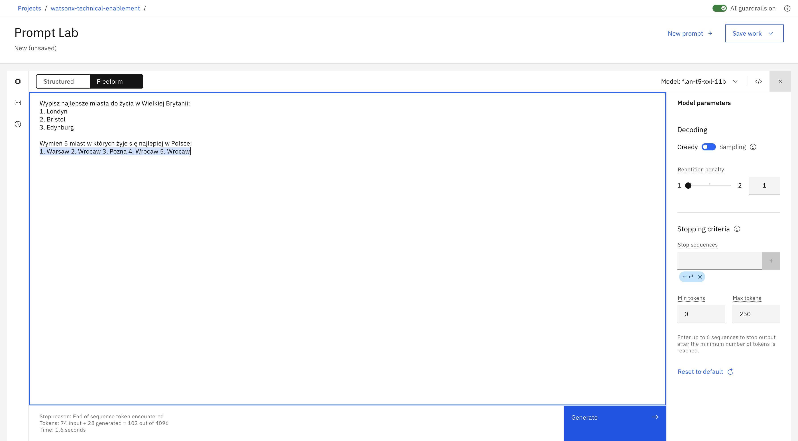

# Prompt engineering

**Note:** Poniższe obrazki przedstawiają rzeczywiste wyniki z watsonx.ai. Lekko szary tekst jest tym, co udostępniliśmy modelowi. Tekst podświetlony na niebiesko to odpowiedź modelu.

### 1.0 Podstawy dużych modeli językowych (LLMs)
Zanim przejdziemy do eksploracji możliwości watsonx.ai, musimy najpierw położyć podwaliny pod to, jak działają duże modele językowe (LLMs) i jak możemy dostroić model i parametry, aby zmienić ich wyniki. 



Kiedy otworzysz watsonx.ai, zobaczysz powyższy widok. Duży centralny obszar tekstowy to Prompt Lab, czyli nic innego jak nasza przestrzeń robocza. Po prawej stronie znajdują się sekcję umożliwiające zmianę parametrów wybranego modelu. Zmiana parametrów wpływa na wygenerowaną przez model treść. Z kolei w lewym dolnym rogu, po wykonaniu zapytania do Prompt Labu, znajduje się podsumowanie liczby tokenów użytych przez generowaniu tesktu.

### 1.1 Tokeny

Za każdym razem, gdy wprowadzisz swój context, Twoje „tokeny wejściowe” i "tokeny wygenerowane” zostaną zaktualizowane. Tokeny to ważna koncepcja, którą należy zrozumieć, ponieważ ograniczają wydajność modelu oraz określają koszt korzystania z modeli. Jak dowiesz się w laboratoriach, tokeny nie odpowiadają słowom w języku naturalnym w stosunku 1:1, ale średnio jeden token odpowiada 4 znakom. Przed wysłaniem swojego tekstu wejściowego do modelu tekst wejściowy jest tokenizowany lub dzielony na mniejsze podzbiory znaków, które będą lepiej zrozumiałe dla modelu.

Istotne jest, aby zrozumieć monitorowanie użycia tokenu, aby wiedzieć, ile informacji wprowadzasz do modelu z każdym tekstem wejściowym, a także ile tekstu jest dla Ciebie wygenerowane. W zależności od modelu wybranego w Prompt Labie, zobaczysz maksymalnie 2048 lub 4096 tokenów. Pamiętaj, że im bardziej dokładny jesteś w swoich instrukcjach, tym mniej miejsca na odpowiedź ze strony modelu.

### 1.2 Wszystko tkwi w tekście wejściowym

watsonx.ai nie jest interfejsem chatbota, więc samo określenie instrukcji lub pytania rzadko daje dobry wynik. Na przykład, co jeśli poprosimy watsonx.ai o:
```
Najlepsza atrakcja turystyczna w Polsce
```



<p> </p>

### 1.3 Podpowiedz oczekiwaną strukturę wyjściową

Z powyższego przykładu widać, że proste teksty wejściowe nie działają w przypadku mniejszych LLM. Aby otrzymać ustrukturyzowaną odpowiedź, dołącz wskazówkę rozpoczynającą odpowiedź w żądanej strukturze. Na przykład samo dodanie tych dwóch znaków „1.” radykalnie poprawia odpowiedź.


<p> </p>

### 1.4 Przygotuj schemat swojej odpowiedzi (Single Shot Prompting)

Aby otrzymać odpowiedź o wyższej jakości, podaj przykład pożądanej odpowiedzi. Z technicznego punktu widzenia nazywa się to Single Shot Prompting. 


Tak jak widać, podanie jednego przykładu przed wygenerowaniem oczekiwanej odpowiedzi za pomocą LLM nazywa się Single Shot Prompting. Generalnie, dodawanie większej liczby przykładów jest również powszechną praktyką. Ogólnie rzecz biorąc, zwiększenie liczby przykładów jest określane jako Few Shot Prompting i jest to potężne narzędzie zapewniające uzyskanie określonego wyniku.


Skopiuj, wklej i rozpocznij własny eksperyment:

```
Wypisz najlepsze miasta do życia w Wielkiej Brytanii:
1. Londyn
2. Bristol
3. Edynburg

Wypisz najlepsze miasta do życia w Polsce:
```

### 1.5 Dołącz szczegóły

Im więcej wskazówek przekażesz, tym lepiej.

Wybrane wskazówki:
- Długość tekstu, 
- Treść tekstu,
- Styl tekstu



# Parametry modelu


### 2.0 Dostosuj zachowanie swojego modelu
Pierwszą zmianą jaką możemy wprowadzić to typ modelu (LLM), który ma być wykorzystany do rozpoznania i wygenerowania odpowiedzi na zadaną przez nas frazę. Jest to najistotniejszy typ zmiany jaką można dokonać, albowiem poszczególne modele radzą sobie lepiej z poszczególnymi typami zadań. Ćwiczenia w dalszej części tego laboratorium zmuszą Cię do zmiany używanego modelu, jeśli chcesz odpowiedzieć na niektóre z trudniejszych pytań.

Ogólnie rzecz biorąc, niektóre modele lepiej radzą sobie z podsumowaniem, słowami kluczowymi i semantyką, podczas gdy inne modele radzą sobie lepiej z tekstem strukturalnym, takim jak HTML lub JSON. Najlepszym sposobem, aby dowiedzieć się, które modele mają zastosowanie w twoim przypadku użycia, jest po prostu je przetestować, ale ważne jest, aby wiedzieć, że wybór modelu może mieć duże znaczenie!

watsonx.ai zapewnia również wiele parametrów do konfigurowania sposobu reagowania LLM na tekst wejściowy. Wybór właściwych parametrów często może być bardziej sztuką niż nauką. Zainwestowanie czasu w zrozumienie, a następnie poprawienie tych parametrów zostanie nagrodzone lepszymi wynikami.

Wypróbuj parametry z podanym przykładem: 
```
Wypisz najlepsze miasta do życia w Wielkiej Brytanii:
1. Londyn
2. Bristol
3. Edynburg

Wypisz najlepsze miasta do życia w Polsce:
```

### 2.1 Ustaw minimalną oraz maksymalną liczbę tokenów

Jeśli uważasz, że wygenerowany tekst jest za krótki lub za długi, spróbuj dostosować parametry kontrolujące liczbę nowych tokenów:

- Parametr **Min new tokens** kontroluje minimalną liczbę tokenów (~słów) w generowanej odpowiedzi
- Parametr **Max new tokens** kontroluje maksymalną liczbę tokenów (~słów) w generowanej odpowiedzi





### 2.2 Określ sekwencje zatrzymania

Jeśli określisz sekwencje zatrzymania, wyjście zostanie automatycznie zatrzymane, gdy w wygenerowanym wyjściu pojawi się jedna z sekwencji zatrzymania.

**Przykład**

Dane wyjściowe na poniższym obrazie wygenerowały dwie odpowiedzi:



Na poniższym obrazku określona jest sekwencja zatrzymania dwóch przycisków enter:



Poniższy obrazek przedstawia efekt sekwencji zatrzymania. Dane wyjściowe są zatrzymywane po dwóch przyciskach enter:


### 2.3 Dostosuj parametry dekodowania

Jeśli odpowiedź jest zbyt ogólna lub odwrotnie, jest niewystarczająco kreatywna, rozważ dostosowanie parametrów dekodowania. 

**Dekodowanie** jest procesem znajdowania sekwencji wyjściowej przy danej sekwencji wejściowej:

- **Greedy decoding** wybiera słowo z najwyższym prawdopodobieństwem na każdym etapie procesu dekodowania.
- **Sampling decoding** wybiera słowa z rozkładu prawdopodobieństwa na każdym kroku:
  - **Temperature** odnosi się do wybierania słów o wysokim lub niskim prawdopodobieństwie. Wyższe wartości parametru temperature prowadzą do większej zmienności.
  - **Top-p** odnosi się do wybierania najmniejszego zestawu słów, których skumulowane prawdopodobieństwo przekracza p.
  - **Top-k** odnosi się do wybierania k słów z najwyższym prawdopodobieństwem na każdym kroku. Wyższe wartości prowadzą do większej zmienności.

Zaletą zachłannego dekodowania jest to, że zobaczysz powtarzalne wyniki. Może to być przydatne do testowania.
Ustawienie parametru temperature na 0 w metodzie dekodowania próbkowania (sampling decoding) daje taką samą wariancję jak zachłanne dekodowanie (greedy decoding).




Sprawdź:

- [Najczęściej używane metody dekodera](https://medium.com/nlplanet/two-minutes-nlp-most-used-decoding-methods-for-language-models-9d44b2375612)
- [Korzystanie z różnych metod dekodowania](https://huggingface.co/blog/how-to-generate)

<p> </p>

### 2.4 Dodaj karę za powtórzenia

Czasami zobaczysz powtarzający się tekst:



Podniesienie parametru temperature może czasem rozwiązać problem.

Jeśli jednak tekst nadal się powtarza, nawet przy wyższej temperaturze, możesz spróbować dodać karę za powtarzanie. Im wyższa kara, tym mniejsze prawdopodobieństwo, że wyniki będą zawierać powtarzający się tekst.


# Rady

### 3.1 Wypróbuj różne typy modeli

Dokumentacja watsonx.ai opisuje dostępne modele: [watsonx.ai models](https://workbench.res.ibm.com/docs/models)

### 3.2 Przewodnik jak korzystać z LLM
Sprawdź przewodnik: [Guidelines for using LLMs in IBM work](https://github.ibm.com/spackows/2023-Workshop-LLMs-for-CD/blob/main/Day-1-instructions.md#guidelines-for-using-llms-in-ibm-projects)

### 3.3 Sprawdź swój use case

LLM mają ogromny potencjał, ale nie mają logiki, wiedzy ani doświadczenia w dziedzinie. Niektóre przypadki użycia są lepiej dopasowane niż inne: LLM przodują w zadaniach, które obejmują generowanie ogólnego tekstu lub wspólnych wzorców kodu i przekształcanie danych wejściowych.

Jeśli Twój teskt wejściowy zawiera wszystkie omówione tutaj wskazówki i najlepsze praktyki, ale żaden z modeli nie daje dobrych wyników, zastanów się, czy Twój przypadek użycia może być przypadkiem, z którym LLM po prostu nie mogą sobie dobrze poradzić.

# Przydatne linki

- [OpenAI prompt intro](https://platform.openai.com/docs/guides/completion/prompt-design)
- [OpenAI prompt engineering tutorial](https://help.openai.com/en/articles/6654000-best-practices-for-prompt-engineering-with-openai-api)
- [co:here prompt engineering tutorial](https://docs.cohere.ai/docs/prompt-engineering)
