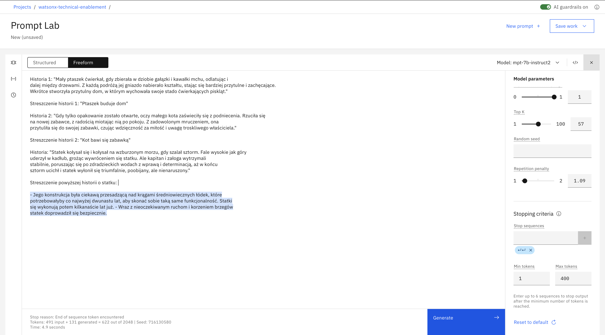

# Prompt engineering exercise answers

<table>
<tr>
<td><a href="#1-generate">1. Wygeneruj</a></td>
<td>Napisz trzy sentencje na temat zwierząt</td>
</tr>
<tr>
<td><a href="#2-rewrite">2. Napisz od nowa</a></td>
<td>Przekształć Markdown do HTML</td>
</tr>
<tr>
<td><a href="#3-summarize">3. Sumaryzacja</a></td>
<td>Streść historię</td>
</tr>
<tr>
<td><a href="#4-summary-points">4. Punkty podsumowujące</a></td>
<td>Stwórz listę tematów bazując na transkrypcji spotkania</td>
</tr>
<tr>
<td><a href="#5-study-questions">5. Przewidywanie pytań</a></td>
<td>Przewiduj potencjalne pytania klientów</td>
</tr>
<tr>
<td><a href="#6-text-extraction">6. Ekstrakcja tekstu</a></td>
<td>Wyodrębnij czasowniki ze zdania</td>
</tr>
<tr>
<td><a href="#7-compare">7. Porównanie</a></td>
<td>Określ, które fragmenty mają ze sobą coś wspólnego</td>
</tr>
<tr>
<td><a href="#8-text-search">8. Wyszukaj w tekście</a></td>
<td>Znajdź stronę, która zawiera poszukiwany tekst</td>
</tr>
<tr>
<td><a href="#9-classify">9. Klasyfikacja</a></td>
<td>Wykrywaj intencje użytkowników chatbota</td>
</tr>
<tr>
<td><a href="#10-anomaly-detection">10. Detekcja anomalii</a></td>
<td>Znajdź odbiegający od standardów wpis</td>
</tr>
</table>

&nbsp;

## 1. Wygeneruj
**Cel** 
<table>
<tr>
<td>
Napisz trzy sentencje na temat zwierząt
</td>
</tr>
</table>

**Jedna z możliwych odpowiedzi**

&nbsp;

## 2. Napisz od nowa
**Cel** 
<table>
<tr>
<td>
Przekształć Markdown do HTML
</td>
</tr>
</table>

**Jedna z możliwych odpowiedzi**

&nbsp;

## 3. Sumaryzacja
**Cel** 
<table>
<tr>
<td>
Streść historię
</td>
</tr>
</table>
  
**Jedna z możliwych odpowiedzi**

&nbsp;

## 4. Punkty podsumowujące
**Cel** 
<table>
<tr>
<td>
Stwórz listę tematów bazując na transkrypcji spotkania
</td>
</tr>
</table>

**Jedna z możliwych odpowiedzi**

&nbsp;

## 5. Przewidywanie pytań
**Cel** 
<table>
<tr>
<td>
Przewiduj potencjalne pytania klientów
</td>
</tr>
</table>

**Jedna z możliwych odpowiedzi**

&nbsp;

## 6. Ekstrakcja tekstu
**Cel** 
<table>
<tr>
<td>
Wyodrębnij czasowniki ze zdania
</td>
</tr>
</table>

**Jedna z możliwych odpowiedzi**

&nbsp;

## 7. Porównanie
**Cel** 
<table>
<tr>
<td>
Określ, które fragmenty mają ze sobą coś wspólnego
</td>
</tr>
</table>

**Jedna z możliwych odpowiedzi**

&nbsp;

## 8. Wyszukaj w tekście
**Cel** 
<table>
<tr>
<td>
Znajdź stronę, która zawiera poszukiwany tekst
</td>
</tr>
</table>

**Jedna z możliwych odpowiedzi**

&nbsp;

## 9. Klasyfikacja
**Cel** 
<table>
<tr>
<td>
Wykrywaj intencje użytkowników chatbota
</td>
</tr>
</table>

**Jedna z możliwych odpowiedzi**

&nbsp;

## 10. Detekcja anomalii
**Cel** 
<table>
<tr>
<td>
Znajdź odbiegający od standardów wpis
</td>
</tr>
</table>

**Jedna z możliwych odpowiedzi**

&nbsp;

