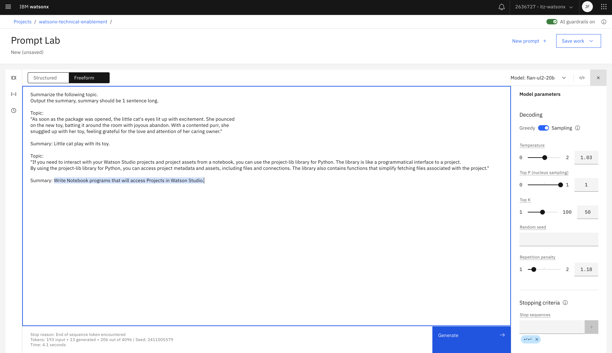
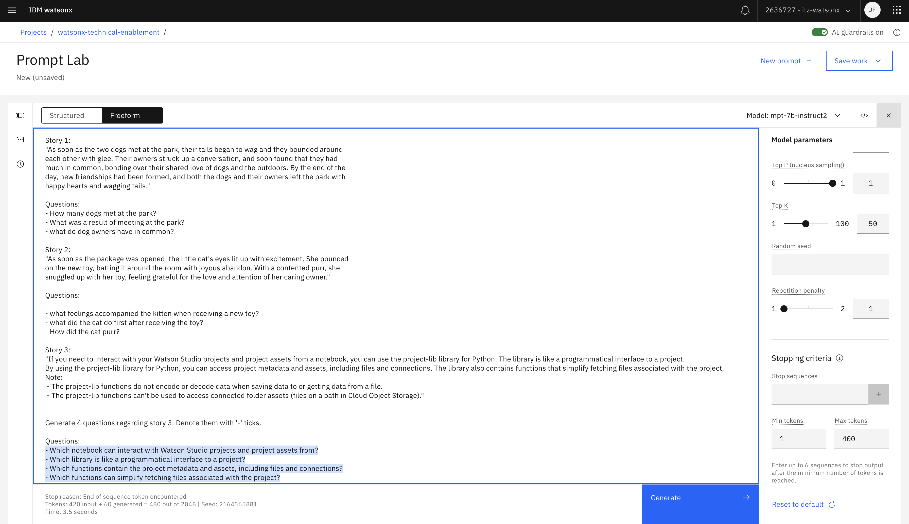

# Prompts with content exercise answers

<table>
<tr>
<td><a href="#1-summarize-documentation-topic">1. Krótkie podsumowanie tekstu</a></td>
<td>Stwórz krótkie podsumowanie tekstu</td>
</tr>
<tr>
<td><a href="#2-documentation-topic-summary-points">2. Punkty podsumowujące</a></td>
<td>Utwórz listę punktów podsumowania dla dokumentacji</td>
</tr>
<tr>
<td><a href="#3-documentation-topic-study-questions">3. Pytania na temat zadanego problemu</a></td>
<td>Stwórz listę pytań na temat zadanego problemu</td>
</tr>
</table>

&nbsp;

## 1. Krótkie podsumowanie tekstu
**Cel** 
<table>
<tr>
<td>
Stwórz krótkie podsumowanie tekstu pochodzącego z dokumentacji Cloud Pak For Data: <a href="https://dataplatform.cloud.ibm.com/docs/content/wsj/analyze-data/project-lib-python.html">Using project-lib for Python</a>
</td>
</tr>
</table>

**Jedna z możliwych odpowiedzi**

&nbsp;

## 2. Punkty podsumowujące
**Cel** 
<table>
<tr>
<td>
Wypisz najistotniejsze punkty tekstu pochodzącego z dokumentacji Cloud Pak For Data: <a href="https://dataplatform.cloud.ibm.com/docs/content/wsj/analyze-data/project-lib-python.html">Using project-lib for Python</a>
</td>
</tr>
</table>

**Jedna z możliwych odpowiedzi**

&nbsp;

## 3. Pytania na temat zadanego problemu
**Cel** 
<table>
<tr>
<td>
Wygeneruj pytania na temat tekstu pochodzącego z dokumentacji Cloud Pak For Data: <a href="https://dataplatform.cloud.ibm.com/docs/content/wsj/analyze-data/project-lib-python.html">Using project-lib for Python</a>
</td>
</tr>
</table>
  
**Jedna z możliwych odpowiedzi**

&nbsp;

## Uwaga
Wszystkie zdania i historie – o ptakach, szczeniakach, kociakach i osłach – zostały wygenerowane za pomocą chatGPT.

&nbsp;

