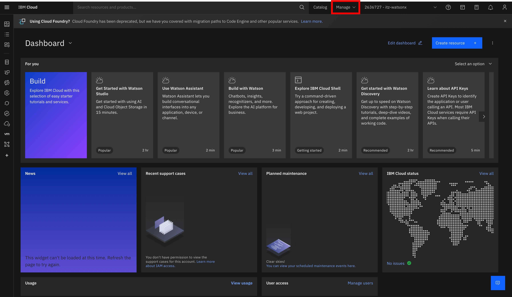
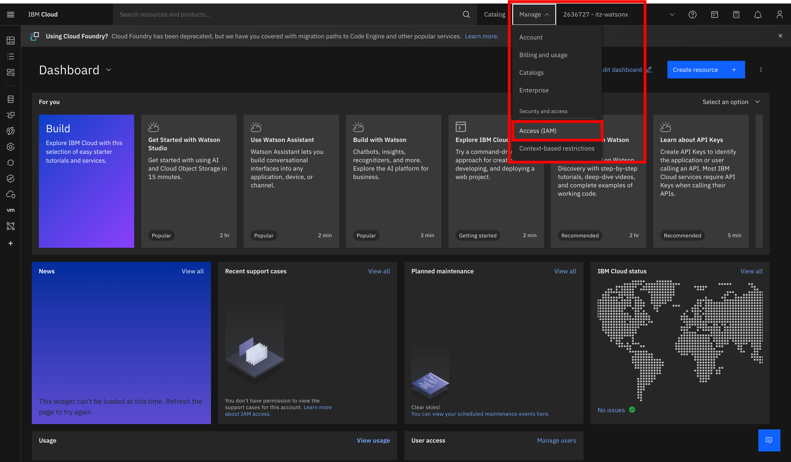
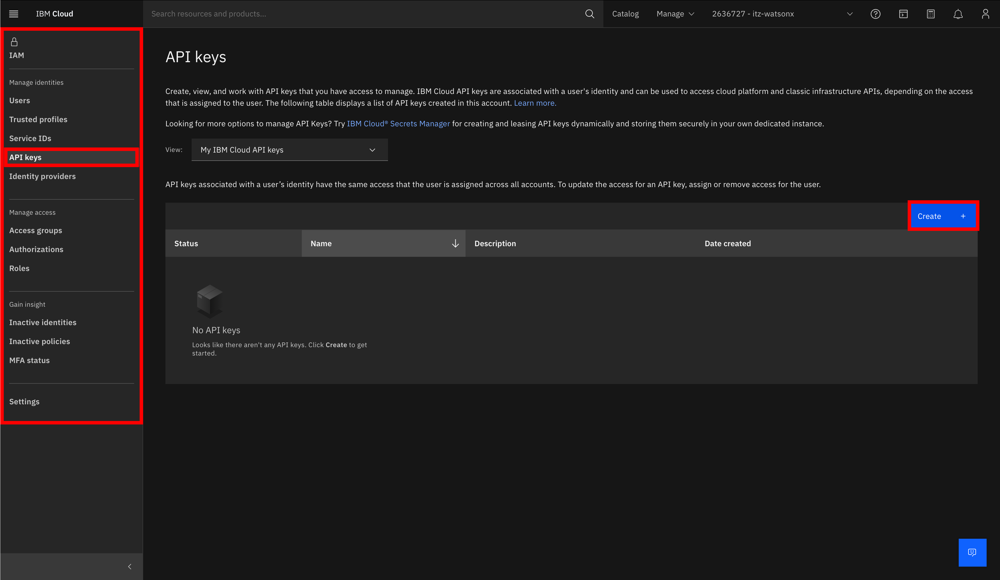
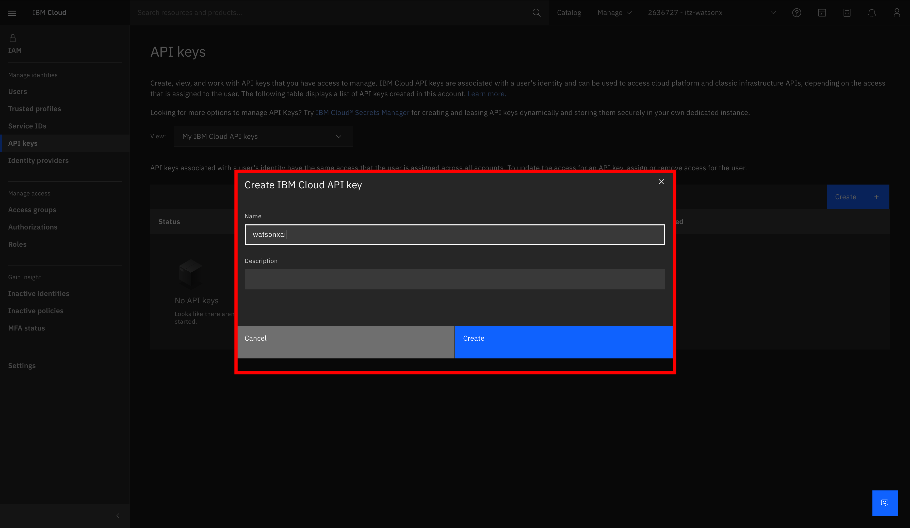
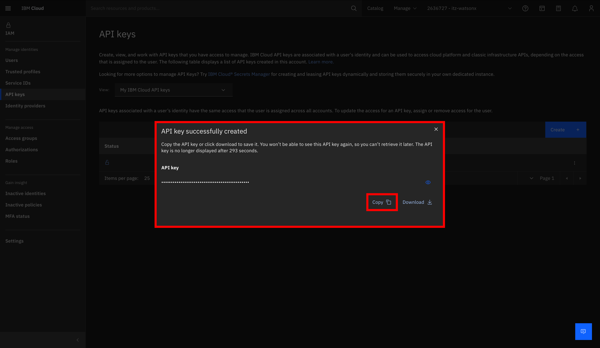

# Lab 2 - Zaawansowany Prompt Engineering

### Wprowadzenie

W podanym [Jupyter Notebook](./prompt_engineering_challenge.ipynb) znajdziesz 10 ćwiczeń, które obejmują szeroki wachlarz zastosowania platformy watsonx.ai z poziomu kodu w Pythonie. Każde pytanie ma przygotowany sugerowany wynik, z którym można porównać własne wyniki. 

### Uzyskanie api_key
W ramach tego laboratorium będziemy łączyć się do środowiska watsonx.ai z poziomu kodu. Będzie nam do tego niezbędny nasz unikalny klucz - api_key - który wygenerować można z poziomu konta w IBM Cloud. Oto kilka kroków jak to zrobić:

1. Logujemy się do naszego konta na IBM Cloud, a następnie udajemy się do zakładki Manage

  

2. Po rozwinięciu zakładki Manage, wybieramy opcję Access (IAM), znajdującą się w sekcji Security and access

  

3. Po przejściu do Access (IAM), szukamy po lewej stronie zakładki API Keys, a następnie klikamy na "Create" w celu stworzenia nowego klucza API na rzecz dzisiejszych laboratoriów.

  

4. W kolejnym kroku nazywamy nasz klucz - w moim przypadku jest to watsonxai - i klikamy Create

  

5. Następnie należy skopiować nowoutworzony klucz i umieścić go w drugiej sekcji kodu znajdującego się w notebooku prompt_engineering_challenge.ipynb przy zmiennej api_key.

  

